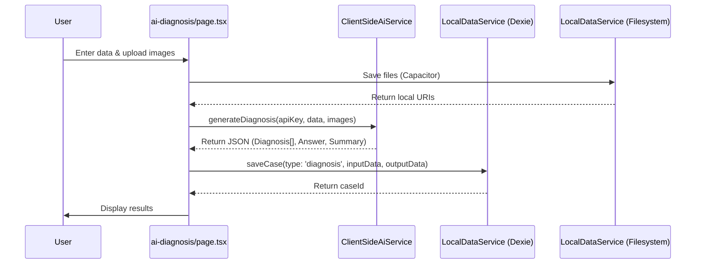
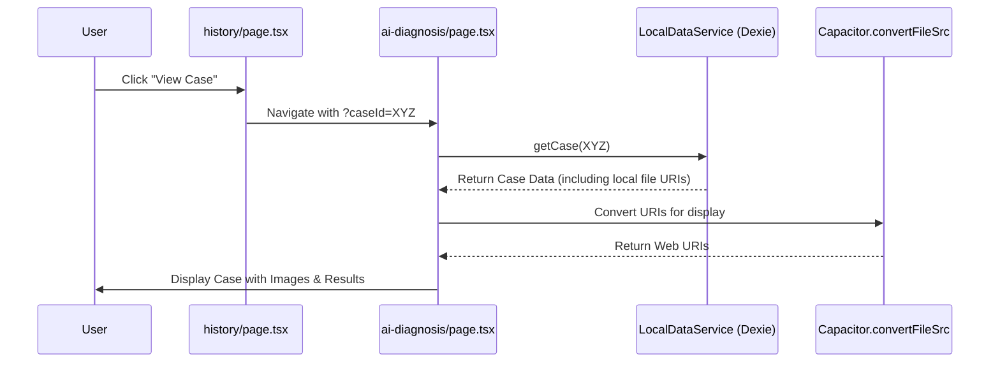

# MediGen: Feature & Workflow Map

This document outlines the complete set of features and the underlying data workflows in the MediGen application, based on the `FULL_PROJECT_OVERVIEW.md`.

## 1. Core Features

### 1.1. AI Diagnosis
- **Goal**: Provide provisional medical diagnoses based on patient context.
- **Inputs**:
  - Patient Data (Text)
  - Supporting Documents (Images/PDFs)
- **Outputs**:
  - Provisional Diagnoses (List with Confidence, Reasoning, Missing Info)
  - Clinical Analysis (Detailed answer to the implicit question)
  - Summarized Question (A concise version of the input)
- **UI Components**: `DiagnosisCard`, `QuestionDisplay`, `Accordion`.

### 1.2. Content Generator
- **Goal**: Create structured medical presentations.
- **Modes**:
  - **Specific Clinical Question**: Generate an answer first, then an outline.
  - **General Medical Topic**: Generate an outline directly.
- **Workflow**:
  1. Input Topic/Question.
  2. Generate Outline (List of topics).
  3. Select Topics.
  4. Generate Slides (Detailed content for each topic).
  5. Edit/Modify (AI-powered expand/replace).
  6. Export (PDF/DOCX).
- **UI Components**: `SlideEditor`, `EnhancedSlideRenderer`.

### 1.3. History & Case Management
- **Goal**: Persist and retrieve past work.
- **Data Flow**:
  - Cases are saved to a local database (Dexie/IndexedDB).
  - Files (images) are saved to the local filesystem (Capacitor).
  - Cases are listed in the History page.
  - Selecting a case loads it back into the original feature page with full state.

---

## 2. Data Workflows

### 2.1. AI Diagnosis Submission Workflow

### 2.2. History Loading Workflow (AI Diagnosis)

---

## 3. Critical Data Structures

### 3.1. Diagnosis Object
- `diagnosis`: string
- `confidenceLevel`: number (0-1) -> *Note: UI expects number for progress bar*
- `reasoning`: string
- `missingInformation`: { information: string[], tests: string[] }

### 3.2. Case Object (Local)
- `id`: string
- `type`: 'diagnosis' | 'content-generator'
- `inputData`: { patientData, supportingDocuments (URIs), structuredQuestion }
- `outputData`: { diagnoses, clinicalAnswer, slides, etc. }
